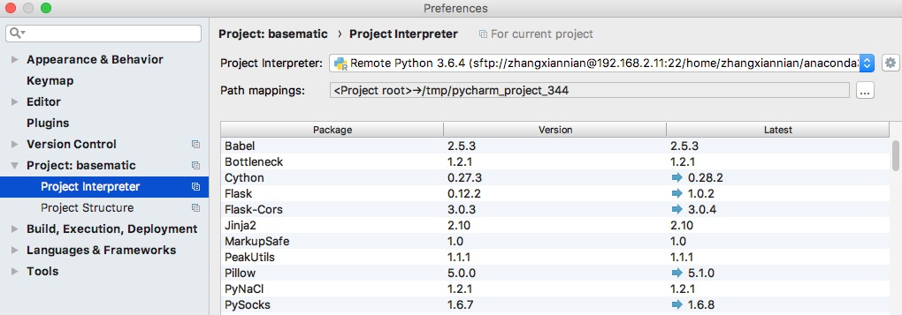

测试与快速开发
============
文档和测试是软件开发中最容易被忽略的地方，但是也是最重要的所在，它们直接关系了代码是否可靠，以及能否被快速的更新迭代。
快速的对于小功能的改进进行测试，能够及早发现问题，增加对于代码的信心。

但是对于生信软件来说，因为对于软件、数据和平台的依赖较高，很难在开发环境下进行完整的测试。我们目前使用如下方式直接使用远程服务器作为测试端，
并且做到几乎实时的开发测试循环；

同步代码到远端
-------------
使用pycharm的远端解释器功能；

