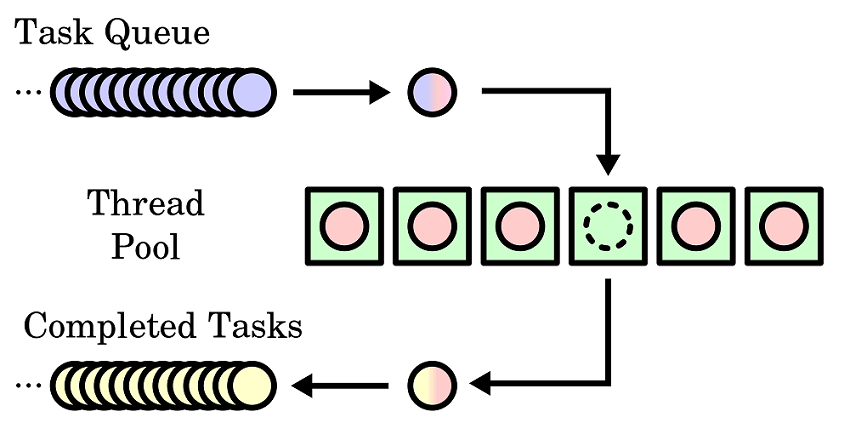

并行处理
========
并行处理，可以充分发挥硬件多核多线程的处理能力，加速软件的运行速度。例如如下的场景：

- 对于多个样本同时进行比对、基因定量或者任何软件；
- 同时统计一个bam文件在多个位点的覆盖深度；

并行处理主要包括多线程和多进程。多线程无需复制当前进程的内存，线程间共享内存，系统资源占用小。
相比而言，多进程启动较慢。

对于多个任务，我们一般建立和维护多个等待接受和执行任务的进程或者线程，称之为线／进程池。对于大量任务，这避免了它们被频繁创建和销毁的开销。
任务队列按照顺序进入线程池中空闲的worker中进行处理，直到所有任务的结束。

使用方式
--------
使用线程池
::
    from multiprocessing.pool import ThreadPool
    pool = ThreadPool(processes=10)
    results = []
    for data in datas:
        results.append(pool.apply_async(data_function, (para1, para2,)))
    pool.close()
    pool.join()

使用进程池
::
    import multiprocessing as mp
    pool = mp.Pool(processes=10)
    results = []
    for data in datas:
        results.append(pool.apply_async(data_function, (para1, para2,)))
    pool.close()
    pool.join()
    results = [x.get() for x in results]
