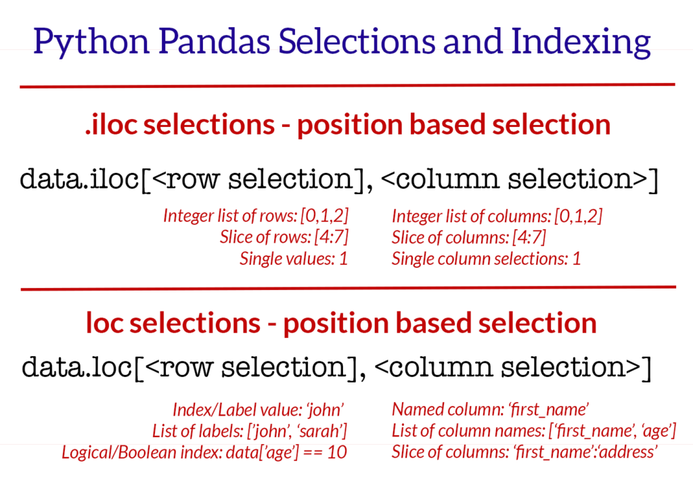

数据框操作
===========
数据处理大部分是在和数据框打交道。熟悉数据框的读写，生成，转换，可视化，以及变换方式，
能够使用更少的代码快速实现大部分常见的操作。

python中主流的数据框操作包是 pandas_ .

.. _pandas: https://pandas.pydata.org/

Read & Save
------------
读取路径，默认为csv的","为分隔符。
::
    read.table(path, sep=",", comment="#", header=T)
保存数据框, csv/tsv/xls
::
    df.to_csv("data.csv")   #csv
    df.to_csv("data.txt", sep="\t") #tsv
    df.to_excel("data.xls") #Excel

Selection
------------
dataframe有两种主要的selction的方式

- df.loc[] 适用于行列名称进行取值；
- df.iloc[] 使用行列的位置；

Group
------------
数据框中很多处理涉及到数据的行之间的分组，合并和转换。pandas为之定义了一套完整的 操作方法_ 。

.. image:: http://p8v379qr8.bkt.clouddn.com/pandas_aggregation.png

上图包含了一个完整的常见数据处理流程，数据框经过筛选，分组，转换成为一个新的数据框。

.. _操作方法: https://www.shanelynn.ie/summarising-aggregation-and-grouping-data-in-python-pandas/

